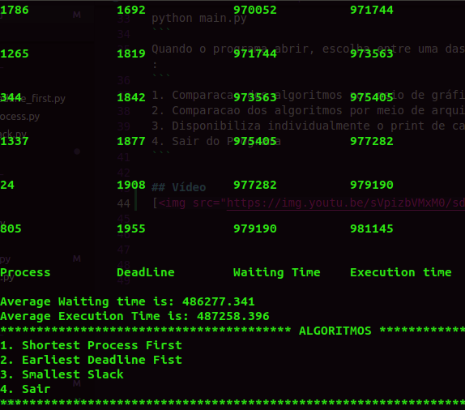

# SchedulingCompare

**Número da Lista**: 13<br>
**Conteúdo da Disciplina**: Greedy Algorithms<br>

## Alunos
|Matrícula | Aluno |
| -- | -- |
| 16/0124778  |  Ian Pereira de Sousa Rocha |
| 15/0135521  |  Leonardo da Silva Santos Barreiros |

## Sobre 
O programa SchedulingCompare é uma ferramente criada com a intenção de mostrar claramente a diferença de tempo e falhas que os algoritmos de Scheduling possuem através de gráficos por tempo e mostrando o resultado no terminal

## Screenshots




## Instalação 
**Linguagem**: Python<br>

É necessário instalar as dependências:
```
pip install -r requirements
```
É necessário também instalar a dependência da biblioteca MatPlotLib:
```
sudo apt-get install python-tk
```
## Uso 
Para a execução do projeto digite no seu terminal:
```
python main.py
```
Quando o programa abrir, escolha entre uma das opções dadas escrevendo seu número respectivo (1-4):
```
1. Comparacao dos algoritmos por meio de gráfico
2. Comparacao dos algoritmos por meio de arquivo csv
3. Disponibiliza individualmente o print de cada execucao
4. Sair do Programa
```

## Vídeo
[](https://youtu.be/sVpizbVMxM0)